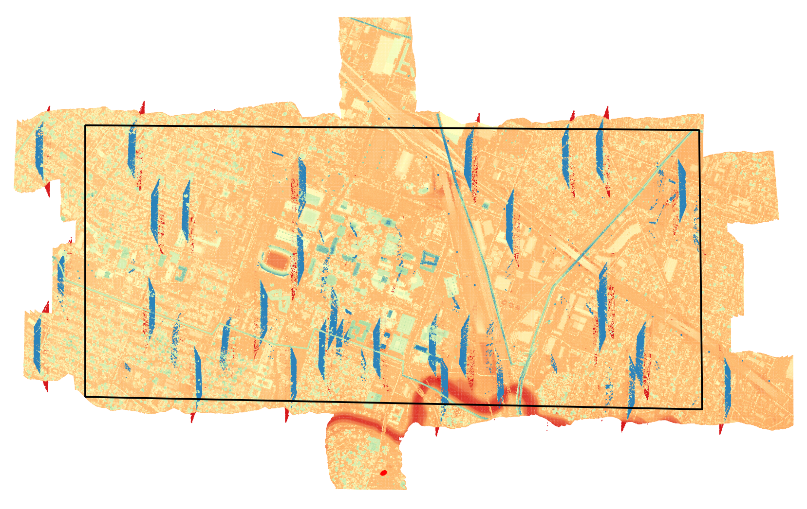

# ALS TPU from Point Clouds

## Motivation

Generating total propagated uncertainty (TPU), also referred to as propagated error, for airborne laser scanning (ALS) xyz coordinate triplets requires knowledge of the ALS observations (and their uncertainties) and the sensor model. By ALS observations we mean the measurements necessary to populate the standard airborne lidar equation: 

    - Lidar range
    - Scanner angle
    - Sensor location (e.g., llh, xyz)
    - Sensor attitude (roll, pitch, heading)
    - Axes misalignment between the scanner and IMU (boresight roll, pitch, heading)
    - Relative location between the scanner and IMU (lever arm xyz)

The above list amounts to 14 measurements (and uncertainties) necessary for each xyz ground coordinate. By sensor model we mean things like the IMU, scanner, and local level reference frame definitions, and rotation types and orders for the boresight and IMU angles. These requirements should, hopefully, make obvious the challenge that geospatial practitioners face when per-point ALS TPU is desired for a point cloud dataset. Neither the ALS observations nor sensor model information is typically available, and even if it were, a non-trivial algorithm will need to be developed to generate the TPU.

## ALS TPU with PDAL

To address the above, two plugin filters have been developed for the Point Data Abstraction Library (PDAL) that enable generation of per-point ALS TPU estimates from lidar point data alone. The first plugin, `filters.sritrajectory`, generates an estimate of the ALS sensor trajectory, which provides six of the necessary ALS observations: sensor location (llh or xyz) and sensor attitude (roll, pitch, heading). Combined with a generic ALS sensor model definition, the estimated trajectory data enables the lidar range and scanner angle to be inverted for each lidar point. This inversion and the ultimate TPU computation is performed in the second PDAL plugin, `filters.als_tpu`. The remaining observations - boresight angles and lever arm displacements - are set equal to zero. These values are typically quite small, so a zero value has little impact on the final TPU values.

For each observation necessary to generate a ground coordinate from the lidar equation, including those set to zero, a corresponding uncertainty must be provided. Many of these are assumed static for a given ALS collection campaign (boresight angles, lever arm displacments, sensor location and attitude), or we only have knowledge of a single estimate provided by the sensor manufacturer (lidar range, scanner angle). However, the influences of a non-zero and range-dependent laser beam width and the incidence angle at which the laser beam intercepts the ground surface contribute non-static uncertainties to the scan angle and lidar range that must be individually estimated for each instance of the lidar equation. 

If you are familiar with lidar TPU, the above discussion will make sense - and probably inspire points of contention. If you are not familiar with lidar TPU and wish to have a better grasp on what `filters.als_tpu` is producing, review the references provided at the end of this document.

## Example Workflow

With introductory remarks out of the way, let's walk through a real-world example of generating per-point TPU for a lidar point cloud dataset. We have been provided with 19 tiles of ALS data collected over the University of Houston campus in LAS file format and our colleague has requested TPU on the data inside an area of interest, which they have defined with a KML file. 

### **1. Prerequisites**

1. We'll be using a Bash terminal for much of this work. If you are a Windows user like me and want to follow along, set up WSL2 on your machine and install an Ubuntu distribution.
2. We'll be using GNU parallel, which you can install via `apt-get`. With over 350 million points in multiple files, using all your CPUs is a good thing.
3. We'll be using PDAL and Entwine command line interface (CLI) applications. Probably the easiest way to get those applications on your machine is via Conda. You'll need to install Miniconda into your WSL2 Ubuntu distribution. Once that is done, create a Conda environment and install PDAL and Entwine into it via conda-forge.
4. In order to use the `sritrajectory` and `als_tpu` plugin filters, you'll need to build both of them from source. Unfortunately, the `sritrajectory` filter is not open to the public yet (efforting on that). Source files and install instructions for the `als_tpu` filter are found [here](https://github.com/pjhartzell/pdal-als-tpu).
5. Finally, we'll also be using CloudCompare and QGIS to visualize the point clouds.


### **2. Data Exploration**

The first thing we want to do is visualize the data to get some context. We can use CloudCompare or QGIS to do this. However, there are a few snags.  First, the provided LAS files do not contain a coordinate reference system (CRS). While this is not a deal breaker, it's bad form and prevents us from overlaying the provided KML boundary data. So let's use PDAL's `translate` command to add a CRS and, while we are at it, convert the files to compressed LAZ format. Based on metadata found elsewhere, we know the datum is WGS84, the projection is UTM Zone 15N, and the elevations are ellipsoidal. We'll store the LAZ files in a new directory and leave the original LAS tiles alone after this. My current directory structure is this:

```
(pdal) pjhartze@GSE-10:/mnt/f/uh$ tree -d
.
└── tiles
    └── las
```

Let's convert to LAZ while adding the correct CRS. We'll use GNU parallel to get more done, faster.

```
(pdal) pjhartze@GSE-10:/mnt/f/uh$ mkdir ./tiles/laz
(pdal) pjhartze@GSE-10:/mnt/f/uh$ tree -d
.
└── tiles
    ├── las
    └── laz
(pdal) pjhartze@GSE-10:/mnt/f/uh$ ls ./tiles/las/*.las | parallel -j+0 pdal translate {} ./tiles/laz/{/.}.laz --readers.las.override_srs=epsg:32615

```

The second issue is that loading millions of points into CloudCompare or QGIS can take a long time and make viewing laggy. I'd prefer to load the data into QGIS so we can easily overlay the KML of the area of interest. For this, we'll convert our LAZ data into an Entwine Point Tile (EPT) index, which will enable us to view the point cloud data inside QGIS without loading all the points at once. This will take some time, but better to burn time once than every time you want to view the data.

```
(pdal) pjhartze@GSE-10:/mnt/f/uh$ entwine build -i ./tiles/laz -o ./tiles/ept/
(pdal) pjhartze@GSE-10:/mnt/f/uh$ tree -d
.
└── tiles
    ├── ept
    │   ├── ept-data
    │   ├── ept-hierarchy
    │   └── ept-sources
    ├── las
    └── laz
```

Now we can very quickly view this data inside QGIS by going to the **Data Source Manager** > **Point Cloud** and browsing to the to the newly created `ept.json` file. We can color by the Z coordinate and overlay the KML area of interest (black box in this case).



Ah! We see that our colleague has requested virtually the entire data collect. Therefore, we'll generate TPU for all the data and clip to their desired boundary at the end. There is also some funky data in there - what's up with the blue trapezoidal looking things? If we go to **View** > **New 3D Map View** and look at the data obliquely, we can see the trapezoids appear to be clusters of mid-air returns. If we select the **Identify** tool and click one these artifact points, we find that they do not have a classification value, i.e., their classification value is zero. We'll use this knowledge to remove these points during our processing.


We can also color the data by `PointSourceId`, which makes it clear that this field holds the flightline number.


With some context on how much of the data needs to be processed (all of it), knowledge of some artifacts that will need to be removed, and the field that stores the flightline value, we are ready to move on. 

### **3. Surface Normals**

In order to include the influence of the laser ray to ground surface incidence angle in the TPU estimation, we need a surface normal for each point. We should also remove the in-air point returns discovered during data exploration before computing the normals. We can use PDAL to accomplish both tasks.

```
(pdal) pjhartze@GSE-10:/mnt/f/uh$ mkdir ./tiles/laz-normal
(pdal) pjhartze@GSE-10:/mnt/f/uh$ tree -d
.
└── tiles
    ├── ept
    │   ├── ept-data
    │   ├── ept-hierarchy
    │   └── ept-sources
    ├── las
    ├── laz
    └── laz-normal
(pdal) pjhartze@GSE-10:/mnt/f/uh$ ls ./tiles/laz/*.laz | parallel -j+0 pdal translate {} ./tiles/laz-normal/{/.}-normal.laz range normal '--filters.range.limits="Classification![0:0]"' '--filters.normal.knn=64' '--writers.las.minor_version=4' '--writers.las.extra_dims="NormalX=float,NormalY=float,NormalZ=float"'

```

### **4. Flightline Extraction**

We know from our data exploration that each point is tagged with its flightline number in the `PointSourceId` field, so we can extract individual flightlines using PDAL's `filters.range`. We can do this for each tile and each flightline number, which will produce quite a few files given the large number of tile-flightline combinations. Or, we can merge all the tiles into a single file first and then extract each flightline in its entirety from the merged file. The former method is probably better for very large collects where merging all the tiles into a single file would create a monster that your machine can't work with. Our project is small enough (about 350 million points) that the latter brute force approach will work. For reference, I have 64GB or RAM on my machine. We'll also sort by time after the merge so that the eventual extracted flightlines are also sorted by time. This is both good form and required for the `sritrajectory` filter. Get a cup of coffee while this runs - it took 18 minutes on my machine. This is not an operation that we can run parallel.
```
(pdal) pjhartze@GSE-10:/mnt/f/uh$ mkdir merged
(pdal) pjhartze@GSE-10:/mnt/f/uh$ tree -d
.
├── merged
└── tiles
    ├── ept
    │   ├── ept-data
    │   ├── ept-hierarchy
    │   └── ept-sources
    ├── las
    ├── laz
    └── laz-normal
(pdal) pjhartze@GSE-10:/mnt/f/uh$ echo '{ "pipeline": [ "./tiles/laz-normal/*.laz", { "type":"filters.merge" }, { "type":"filters.sort", "dimension":"GpsTime" }, { "type":"writers.las", "filename":"./merged/normal.laz", "minor_version":4, "extra_dims":"all" } ] }' | pdal pipeline --stdin
```

In order to extract by flightline, we need the flightline numbers. We can list all the flightline numbers in the merged file using PDAL's `info` command and `enumerate` option. To save space, I'm only going to show the relevant output below. The ellipses (`...`) indicate locations of the additional (not shown) output. this command also took quite some time.
```
(pdal) pjhartze@GSE-10:/mnt/f/uh$ pdal info ./merged/normal.laz --enumerate "PointSourceId"
...

      {
        "average": 574.5223646,
        "count": 355211315,
        "maximum": 1113,
        "minimum": 111,
        "name": "PointSourceId",
        "position": 11,
        "stddev": 307.0998069,
        "values":
        [
          111,
          112,
          113,
          211,
          212,
          213,
          311,
          312,
          313,
          411,
          412,
          413,
          511,
          512,
          513,
          611,
          612,
          613,
          711,
          712,
          713,
          811,
          812,
          813,
          911,
          912,
          913,
          1011,
          1012,
          1013,
          1111,
          1112,
          1113
        ],
        "variance": 94310.29138
...
```

Now we are ready to extract flightlines, and once again take advantage of the `parallel` package. Note that we are using a different method for feeding arguments into `parallel`. We could generate correct `stdin` by placing the flightline numbers into an array variable and then pipe them into `parallel` via a `printf` command, but the method shown below is cleaner. Plus, we'll be using this new method again in the next step, so no sense avoiding it.
```
(pdal) pjhartze@GSE-10:/mnt/f/uh$ mkdir flightlines
(pdal) pjhartze@GSE-10:/mnt/f/uh$ tree -d
.
├── flightlines
├── merged
└── tiles
    ├── ept
    │   ├── ept-data
    │   ├── ept-hierarchy
    │   └── ept-sources
    ├── las
    ├── laz
    └── laz-normal
(pdal) pjhartze@GSE-10:/mnt/f/uh$ lines="111 112 113 211 212 213 311 312 313 411 412 413 511 512 513 611 612 613 711 712 713 811 812 813 911 912 913 1011 1012 1013 1111 1112 1113"
(pdal) pjhartze@GSE-10:/mnt/f/uh$ parallel -j+0 pdal translate ./merged/normal.laz ./flightlines/line-{}.laz range '--filters.range.limits="PointSourceId[{}:{}]"' '--writers.las.minor_version=4' '--writers.las.extra_dims="all"' ::: $lines
```

We also need to sort the flightline data by time - it's good form and because the trajectory creation filter requires it. I attempted to add a `filters.sort` to the prior command after the `range` filter, but it consistently broke WSL2, so I ran it separately.
```
(pdal) pjhartze@GSE-10:/mnt/f/uh$ ls ./trajectories/*.laz | parallel pdal translate {} {} sort '--filters.sort.dimension="GpsTime"
```

Perhaps it would have been better to run sort when creating the merged file - yes, I think it would have been. :-)

### **5. Trajectory Creation**

We will only create trajectories for channel 2, which is nadir looking. The other channels have a constant forward-looking angle that `filters.sritrajectory` will incorrectly interpret as a sensor pitch value. The channel number is actually the last digit of the each flightline number. For example, flightline 211 is actually line 21, channel 1; flightline 212 is line 21, channel 2; and flightline 213 is line 21, channel 3. Note that I've switched to a new Conda environment where I have the `sritrajectory` plugin installed.
```
(pdal) pjhartze@GSE-10:/mnt/f/uh$ mkdir trajectories
(pdal) pjhartze@GSE-10:/mnt/f/uh$ tree -d
.
├── flightlines
├── merged
├── tiles
│   ├── ept
│   │   ├── ept-data
│   │   ├── ept-hierarchy
│   │   └── ept-sources
│   ├── las
│   ├── laz
│   └── laz-normal
└── trajectories
(pdal) pjhartze@GSE-10:/mnt/f/uh$ conda activate pdal-als-tpu
(pdal-als-tpu) pjhartze@GSE-10:/mnt/f/uh$ ls ./flightlines/*2.laz | parallel pdal translate {} ./trajectories/{/.}-trajectory.txt sritrajectory '--writers.text.order="X,Y,Z,Roll,Pitch,Heading"'