# ALS TPU from Point Clouds

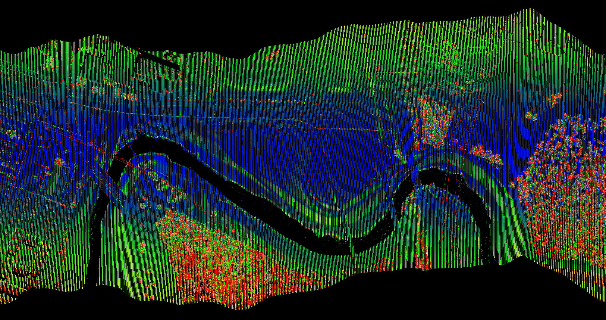

## Motivation

Generating total propagated uncertainty (TPU), also referred to as "propagated error", for airborne laser scanning (ALS) point cloud data requires knowledge of the ALS measurements necessary to compute the ground coordinates, the measurement uncertainties (expressed as standard deviations), and the ALS sensor model. The ALS measurements (or "observations") consist of: 

- Lidar range
- Scanner angle
- Sensor location (e.g., llh, xyz)
- Sensor attitude (roll, pitch, heading)
- Axes misalignment between the scanner and IMU (boresight roll, pitch, heading)
- Relative location between the scanner and IMU (lever arm xyz)

Note that each measurement also needs a corresponding estimated uncertainty. The ALS sensor model refers to items such as the inertial motion unit (IMU), scanner, and local level reference frame definitions, and rotation types and orders for the boresight and IMU angles. Together, the measurement and sensor model information enable us to generate the point cloud coordinates using the standard ALS ground coordinate equation:


We use the ALS ground coordinate equation to propagate the measurement uncertainties into covariance matrices for each ground point via the General Law Of Propagation of Variance (GLOPOV).

The above summary should, hopefully, make obvious the challenge that geospatial practitioners face when per-point ALS TPU is desired for a point cloud dataset. Neither the ALS observations nor the sensor model information is typically available, and even if it were, a non-trivial algorithm would need to be developed to generate the TPU.

## ALS TPU with PDAL

To address the challenge outlined above, two plugin filters have been developed for the [Point Data Abstraction Library](https://pdal.io/) (PDAL) that enable generation of per-point ALS TPU estimates from lidar point data alone. The first plugin, `filters.sritrajectory`, generates an estimate of the ALS sensor trajectory, which provides six (technically five, as roll is not estimated) of the necessary ALS observations: sensor location and attitude (X, Y, Z, Roll, Pitch, Heading). Given trajectory information and a generic ALS sensor model definition, the lidar range and scanner angle measurements for each point can be inverted. This inversion and the ultimate TPU computation is performed in the second PDAL plugin, `filters.als_tpu`. The remaining observations - boresight angles and lever arm displacements - are set equal to zero. These values are typically quite small, so a zero value has little impact on the final TPU values.

For each observation necessary to generate a ground coordinate from the lidar equation, including those set to zero, a corresponding uncertainty must be provided. Many of these are assumed static for a given ALS collection campaign (boresight angles, lever arm displacements, sensor location and attitude), or we only have knowledge of a single estimate provided by the sensor manufacturer (lidar range, scanner angle). However, the influences of a non-zero and range-dependent laser beam width and the incidence angle at which the laser beam intercepts the ground surface contribute non-static uncertainties to the scan angle and lidar range that must be individually estimated for each instance of the lidar equation. 

If you are familiar with lidar TPU, the above discussion will be familiar - and probably inspire points of contention. If you are not familiar with lidar TPU, references are provided at the end of this document. Note that the `sritrajectory` filter is not yet open source (but should be soon). The source code for the `als_tpu` filter is still being refined, but is available on [Github](https://github.com/pjhartzell/pdal-als-tpu).

## Example Workflow

With introductory remarks out of the way, let's walk through a real-world example of generating per-point TPU for a lidar point cloud dataset. We have been provided with 19 tiles of ALS data collected over the University of Houston campus in LAS file format and a colleague has requested TPU on the data inside an area of interest, which they have defined with a KML file.


Before we get going, a word of caution about this example. It uses data from a triple channel (i.e., three laser) ALS sensor, the Optech Titan. This makes some of the processing steps more complex than a traditional single channel ALS sensor.

### **1. Prerequisites**

**Software:**
1. We'll be using a Bash terminal for much of this work. If you are a Windows user like me and want to follow along, set up [WSL2](https://docs.microsoft.com/en-us/windows/wsl/install) on your machine and install a Linux distribution. I'm using Ubuntu.
2. We'll be using [GNU parallel](https://www.gnu.org/software/parallel/), which you can install via `apt-get`. With over 350 million points in multiple files, using all your CPUs is a good thing.
3. We'll be using [PDAL](https://pdal.io/) and [Entwine](https://entwine.io/) command line interface (CLI) applications. Probably the easiest way to get those applications on your machine is via Conda. I recommend installing [Miniconda](https://docs.conda.io/en/latest/miniconda.html) into your WSL2 Linux distribution. Once that is done, create a Conda environment and install PDAL and Entwine into it using the conda-forge channel.
4. In order to use the `sritrajectory` and `als_tpu` PDAL plugin filters, you'll need to build both of them from source. Unfortunately, the `sritrajectory` filter is not open to the public yet (efforting on that). Source files and install instructions for the `als_tpu` filter are on GitHub [here](https://github.com/pjhartzell/pdal-als-tpu).
5. We'll use [CloudCompare](https://www.danielgm.net/cc/) and [QGIS](https://www.qgis.org/en/site/) to visualize the point clouds.

**Information:**
1. Point cloud data from an ALS sensor with an oscillating mirror (sawtooth ground pattern) or rotating mirror (parallel ground pattern) scanning mechanism. Lidar sensors that generate circular ground patterns via a Risley prism are not supported. In our case, we have point cloud data from a Titan sensor, which uses an oscillating mirror.
2. ALS sensor metadata. We need to know the make and model of the laser scanner and the IMU in order to look up predicted measurement uncertainties (e.g., lidar range, scan angle, trajectory location and attitude). This is, perhaps, the weak point in the process since it requires some knowledge of the collection process beyond just the point cloud data. Our data was captured with an Optech Titan coupled with a Northrup Grumman LN200 IMU. Some web searching turns up datasheets that contain the measurement uncertainty information we need. 

### **2. Data Check and Cleaning**

We were supplied 19 LAS files, which I've copied to a `uh/tiles/las` directory on my `F:` drive.

```bash
(pdal-als-tpu) pjhartze@GSE-10:/mnt/f/uh$ tree -d
.
└── tiles
    └── las
```

I'll repeat this directory tree printout throughout the example, but will always exclude files and eventually certain subdirectories to save space. 

Prior to even visualizing the data, it's worth checking that our data contains `GpsTime`, `NumberOfReturns`, and `ReturnNumber` fields. These fields are required for generating trajectories with the `sritrajectory` filter. Let's check one of the LAS files.

```bash
(pdal-als-tpu) pjhartze@GSE-10:/mnt/f/uh$ pdal info ./tiles/las/pt271000_3290000.las --summary
(pdal info readers.las Error) Global encoding WKT flag not set for point format 6 - 10.
{
  "file_size": 439472417,
  "filename": "./tiles/las/pt271000_3290000.las",
  "now": "2021-11-02T14:59:56-0400",
  "pdal_version": "2.3.0 (git-version: 4ef8e5)",
  "reader": "readers.las",
  "summary":
  {
    "bounds":
    {
      "maxx": 271999.99,
      "maxy": 3289999.99,
      "maxz": 258.45,
      "minx": 271065.53,
      "miny": 3289262.77,
      "minz": -282.63
    },
    "dimensions": "X, Y, Z, Intensity, ReturnNumber, NumberOfReturns, ScanDirectionFlag, EdgeOfFlightLine, Classification, ScanAngleRank, UserData, PointSourceId, GpsTime, ScanChannel, ClassFlags",
    "num_points": 14649068
  }
}
```

Good news - the data contains the necessary fields. However, PDAL is concerned about a "WKT flag" not being set. This relates to the coordinate reference system (CRS), so let's see what the CRS is.

```bash
(pdal-als-tpu) pjhartze@GSE-10:/mnt/f/uh$ pdal info ./tiles/las/pt271000_3290000.las --metadata
(pdal info readers.las Error) Global encoding WKT flag not set for point format 6 - 10.
{
  "file_size": 439472417,
  "filename": "./tiles/las/pt271000_3290000.las",
  "metadata":
  {
    "comp_spatialreference": "",
    "compressed": false,
    "count": 14649068,
    "creation_doy": 86,
    "creation_year": 2017,
    "dataformat_id": 6,
    "dataoffset": 377,
    "filesource_id": 0,
    "global_encoding": 0,
    "global_encoding_base64": "AAA=",
    "gtiff": "",
    "header_size": 375,
    "major_version": 1,
    "maxx": 271999.99,
    "maxy": 3289999.99,
    "maxz": 258.45,
    "minor_version": 4,
    "minx": 271065.53,
    "miny": 3289262.77,
    "minz": -282.63,
    "offset_x": 0,
    "offset_y": 0,
    "offset_z": 0,
    "point_length": 30,
    "project_id": "00000000-0000-0000-0000-000000000000",
    "scale_x": 0.01,
    "scale_y": 0.01,
    "scale_z": 0.01,
    "software_id": "TerraScan",
    "spatialreference": "",
    "srs":
    {
      "compoundwkt": "",
      "horizontal": "",
      "isgeocentric": false,
      "isgeographic": false,
      "prettycompoundwkt": "",
      "prettywkt": "",
      "proj4": "",
      "units":
      {
        "horizontal": "unknown",
        "vertical": ""
      },
      "vertical": "",
      "wkt": ""
    },
    "system_id": ""
  },
  "now": "2021-11-02T15:09:19-0400",
  "pdal_version": "2.3.0 (git-version: 4ef8e5)",
  "reader": "readers.las"
```

Uh-oh. There is none. Note the missing `srs` (SRS = Spatial Reference System = CRS) information. While this is not a deal breaker, it's bad form and prevents us from overlaying the provided KML boundary file on the point cloud data. So let's use PDAL's `translate` command to add the CRS to all the tiles and, while we are at it, convert the tiles to compressed LAZ format. Based on metadata provided with the point cloud files, we know the datum is IGS08 (which we'll call "equivalent" to WGS84), the projection is UTM Zone 15N, and the elevations are ellipsoidal => EPSG:32615. We'll store the new LAZ tiles in a new directory and leave the original LAS tiles alone after this.


```bash
(pdal-als-tpu) pjhartze@GSE-10:/mnt/f/uh$ mkdir ./tiles/laz
(pdal-als-tpu) pjhartze@GSE-10:/mnt/f/uh$ tree -d
.
└── tiles
    ├── las
    └── laz
(pdal-als-tpu) pjhartze@GSE-10:/mnt/f/uh$ ls ./tiles/las/*.las | parallel -j+0 pdal translate {} ./tiles/laz/{/.}.laz --readers.las.override_srs=epsg:32615

```

Note that we used the `parallel` package to run the tile translations in order to take advantage of all available CPUs.

One remaining item that we will check later on is the correctness of the `ScanAngleRank` field. In particular, we want to check that the sign of the values is correct. We'll look at this once we extract flightlines from the tiled data.

### **3. Data Visualization**

We can load all the LAZ tiles into, say, CloudCompare, but that's going to take a long time and not perform very well. I'd prefer to load the data into QGIS where we can easily overlay the KML of the area of interest. To do this, we'll convert our LAZ tiles into an Entwine Point Tile (EPT) index, which will enable us to view the point cloud data inside QGIS without loading all the points at once. Building the EPT index will take some time, but better to burn that time once rather than every time you want to view the data.

```bash
(pdal-als-tpu) pjhartze@GSE-10:/mnt/f/uh$ entwine build -i ./tiles/laz -o ./tiles/laz/ept
(pdal-als-tpu) pjhartze@GSE-10:/mnt/f/uh$ tree -d -L 3
.
└── tiles
    ├── las
    └── laz
        └── ept
```

Now we can very quickly view this data inside QGIS by going to the **Data Source Manager** > **Point Cloud** and browsing to the to the newly created `ept.json` file. We can color by the Z coordinate and overlay the KML area of interest (black box in this case).

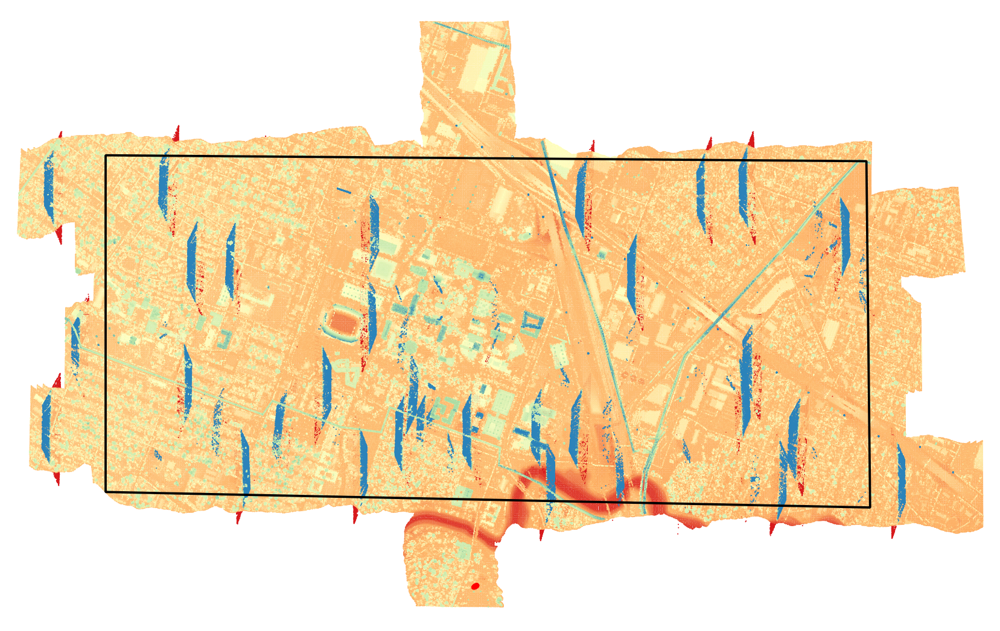

Ah! We see that our colleague has requested virtually the entire data collect. Therefore, we'll generate TPU for all the data and clip to their desired boundary at the end. There is also some funky data in there - what's up with the blue trapezoidal looking things? If we go to **View** > **New 3D Map View** and look at the data obliquely, we can see the trapezoids appear to be clusters of mid-air returns.

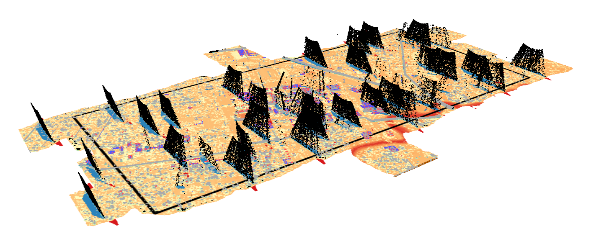

If we select the **Identify** tool and click one these artifact points, we find that they do not have a classification value, i.e., their classification value is zero. We'll use this knowledge to remove these points during subsequent processing. Finally, we can also color the data by `PointSourceId`, which makes it clear that this field holds the flightline number.

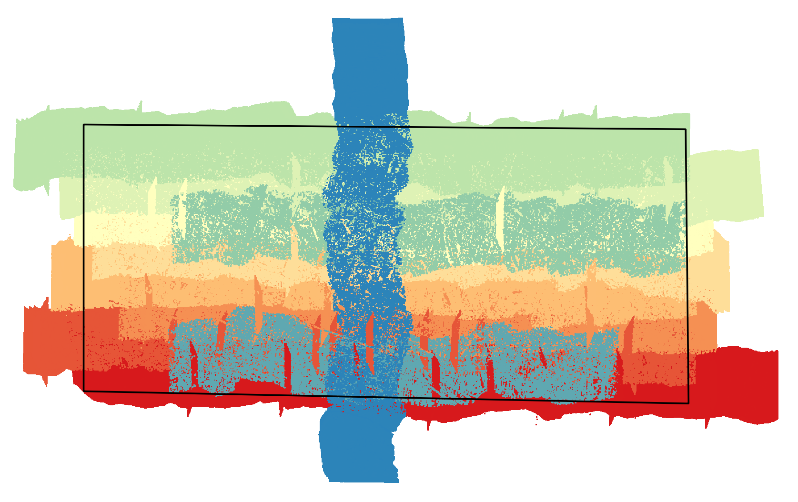

With some context on how much of the data needs to be processed (all of it), knowledge of some artifacts that will need to be removed, and knowledge of the field that stores the flightline number, we are ready to move forward. 

### **4. Surface Normals**

In order to include the influence of the laser ray to ground surface incidence angle in the TPU estimation, we need to compute an estimated surface normal vector for each point. The `als_tpu` filter uses the surface normal to compute the incidence angle. We should also remove the in-air point returns discovered during data visualization before computing the normals. We can use PDAL to accomplish both tasks.

```bash
(pdal-als-tpu) pjhartze@GSE-10:/mnt/f/uh$ mkdir ./tiles/laz-normal
(pdal-als-tpu) pjhartze@GSE-10:/mnt/f/uh$ tree -d -L 3
.
└── tiles
    ├── las
    ├── laz
    │   └── ept
    └── laz-normal
(pdal-als-tpu) pjhartze@GSE-10:/mnt/f/uh$ ls ./tiles/laz/*.laz | parallel -j+0 pdal translate {} ./tiles/laz-normal/{/.}-normal.laz range normal '--filters.range.limits="Classification![0:0]"' '--filters.normal.knn=64' '--writers.las.minor_version=4' '--writers.las.extra_dims="NormalX=float,NormalY=float,NormalZ=float"'
```

### **5. Flightline Extraction**

To generate TPU, we need the data organized in the manner in which it was collected - grouped into flightlines. This allows us to efficiently query the associated flightline trajectory for the sensor position and attitude information for each point. 

We know from our data visualization that each point is tagged with its flightline number in the `PointSourceId` field. We can use that information to extract the individual flightlines using PDAL's `filters.range`. We can do this for each tile and each flightline number, which will produce quite a few files given the large number of tile-flightline combinations. This would also require all the flightlines that span multiple tiles to be merged afterwards. Alternatively, we can merge all the tiles into a single file first and then extract each flightline in its entirety from the merged file. The former method is probably better for very large collects where merging all the tiles into a single file would create a monster that your machine can't work with. Our project is small enough (about 350 million points) that the latter brute force approach will work. For reference, I have 64GB or RAM on my machine. We'll also sort by time after the merge so that the eventual extracted flightline data is also sorted by time. This is both good form and required for the `sritrajectory` filter. Get a cup of coffee while this runs - it took 18 minutes on my machine. This is not an operation we can run parallel.

```bash
(pdal-als-tpu) pjhartze@GSE-10:/mnt/f/uh$ echo '{ "pipeline": [ "./tiles/laz-normal/*.laz", { "type":"filters.merge" }, { "type":"filters.sort", "dimension":"GpsTime" }, { "type":"writers.las", "filename":"./tiles/laz-normal/merged-normal.laz", "minor_version":4, "extra_dims":"all" } ] }' | pdal pipeline --stdin
```

I typically create pipelines in a JSON file and then call `pdal pipeline <my-pipe.json>`. But the above method avoids the requirement to create a separate file, which is fine for simple pipelines (unless you are using pipeline files to document your processing workflow).

In order to extract data by flightline, we need the flightline numbers. We can list all the flightline numbers in the merged file using PDAL's `info` command and `enumerate` option. To save space, I'm only going to show the relevant output below. The ellipses (`...`) indicate locations of the additional (not shown) output. This command also took quite some time.

```bash
(pdal-als-tpu) pjhartze@GSE-10:/mnt/f/uh$ pdal info ./tiles/laz-normal/merged-normal.laz --enumerate "PointSourceId"
...

      {
        "average": 574.5223646,
        "count": 355211315,
        "maximum": 1113,
        "minimum": 111,
        "name": "PointSourceId",
        "position": 11,
        "stddev": 307.0998069,
        "values":
        [
          111,
          112,
          113,
          211,
          212,
          213,
          311,
          312,
          313,
          411,
          412,
          413,
          511,
          512,
          513,
          611,
          612,
          613,
          711,
          712,
          713,
          811,
          812,
          813,
          911,
          912,
          913,
          1011,
          1012,
          1013,
          1111,
          1112,
          1113
        ],
        "variance": 94310.29138
...
```

Create a variable to hold the flightline numbers for use with the `parallel` package.

```bash
(pdal-als-tpu) pjhartze@GSE-10:/mnt/f/uh$ lines="111 112 113 211 212 213 311 312 313 411 412 413 511 512 513 611 612 613 711 712 713 811 812 813 911 912 913 1011 1012 1013 1111 1112 1113"
```

Now we are ready to extract flightlines. Note that we are using a different method for feeding arguments (the flightline numbers in this case) into `parallel` this time. We could generate correct `stdin` by placing the flightline numbers into an array variable and then pipe them into `parallel` via a `printf` command, but the method shown below is cleaner. Plus, we'll be using this new method again in a later step, so no sense avoiding it.

```bash
(pdal-als-tpu) pjhartze@GSE-10:/mnt/f/uh$ mkdir flightlines
(pdal-als-tpu) pjhartze@GSE-10:/mnt/f/uh$ tree -d -L 3
.
├── flightlines
└── tiles
    ├── las
    ├── laz
    │   └── ept
    └── laz-normal
(pdal-als-tpu) pjhartze@GSE-10:/mnt/f/uh$ parallel -j+0 pdal translate ./tiles/laz-normal/merged-normal.laz ./flightlines/{}.laz range '--filters.range.limits="PointSourceId[{}:{}]"' '--writers.las.minor_version=4' '--writers.las.extra_dims="all"' ::: $lines
```

Let's take a look at an extracted flightline to make sure things look reasonable and also, as discussed previously in the Data Check and Cleaning step, check that the signs of the `ScanAngleRank` values are correct. Let's open flightline 111 in CloudCompare and color the points by the `GpsTime` field.

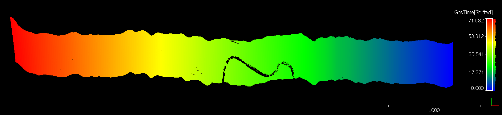

Yep, that looks like a flightline, and we can see that the aircraft was moving from right to left (west). Now let's color the points by `ScanAngleRank`.

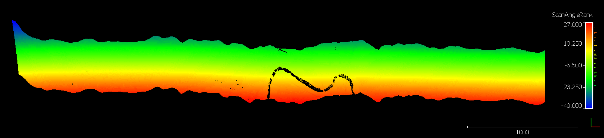

Uh-oh. Per the [ASPRS LAS specification](http://www.asprs.org/wp-content/uploads/2019/03/LAS_1_4_r14.pdf), negative scan angles should be to left side of the aircraft, or downward in this image. These angles are reversed. We need to correct the angles since `filters.sritrajectory` makes use of them (you'll end up with incorrect `Azimuth` and `Pitch` values, otherwise). We'll do this by multiplying the `ScanAngleRank` field of each point by `-1`. We'll move the existing, incorrect flightlines to a new `temp` folder first. PDAL does not allow us to correct the files "in place" (same input and output name and location). We'll delete the existing, incorrect data after we generate corrected files.

```bash
(pdal-als-tpu) pjhartze@GSE-10:/mnt/f/uh$ mkdir ./flightlines/temp
(pdal-als-tpu) pjhartze@GSE-10:/mnt/f/uh$ mv ./flightlines/*.laz ./flightlines/temp/
(pdal-als-tpu) pjhartze@GSE-10:/mnt/f/uh$ ls ./flightlines/temp/*.laz | parallel -j+0 pdal translate {} ./flightlines/{/} assign '--filters.assign.value="ScanAngleRank=ScanAngleRank*(-1)"' '--writers.las.minor_version=4' '--writers.las.extra_dims="all"'
(pdal-als-tpu) pjhartze@GSE-10:/mnt/f/uh$ rm -r ./flightlines/temp
```

Now the `ScanAngleRank` field is correct.

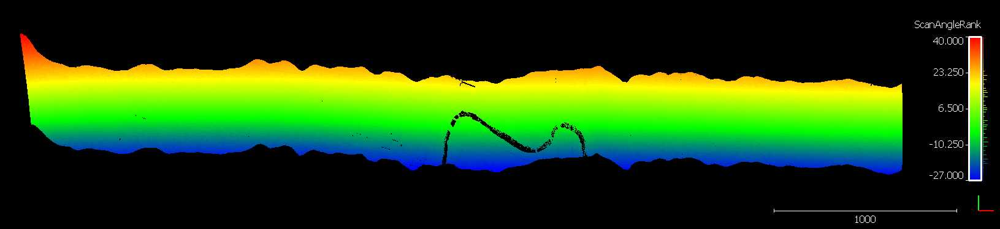

### **6. Trajectory Creation**

We need a trajectory for each flightline in order to generate TPU for each point. However, as noted previously, the Optech Titan is a three channel system, and each channel was extracted into its own flightline in the prior step. The channel number is actually the last digit of the each flightline number. For example, flightline 211 is actually flightline 21, channel 1; flightline 212 is also flightline 21, but channel 2; and, similarly, flightline 213 is flightline 21, channel 3. Therefore, only one trajectory is required for the three channels on each flightline. We will create trajectories using channel 2 data since it is nadir looking. The other channels have a constant forward-looking angle that `filters.sritrajectory` will incorrectly interpret as a sensor pitch value.

```bash
(pdal-als-tpu) pjhartze@GSE-10:/mnt/f/uh$ mkdir trajectories
(pdal-als-tpu) pjhartze@GSE-10:/mnt/f/uh$ tree -d -L 3
.
├── flightlines
├── tiles
│   ├── las
│   ├── laz
│   │   └── ept
│   └── laz-normal
└── trajectories
(pdal-als-tpu) pjhartze@GSE-10:/mnt/f/uh$ ls ./flightlines/*2.laz | parallel -j+0 pdal translate {} ./trajectories/{/.}.txt sritrajectory '--writers.text.order="GpsTime,X,Y,Z,Pitch,Azimuth"' '--writers.text.keep_unspecified="false"'
```

Let's open the trajectory for flightline 112 in CloudCompare (the point cloud for flightline 111 is already loaded) and view from the side.

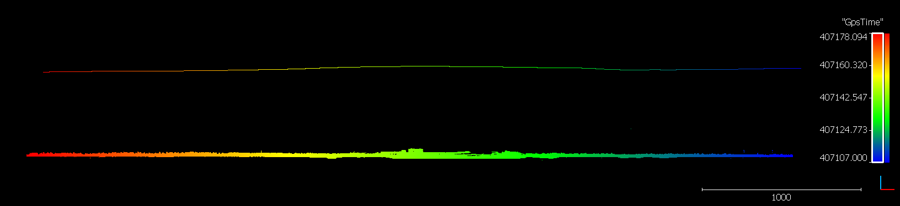

Yep, looks that like an aircraft trajectory above the point cloud. Both are colored by `GpsTime`.

### **7. Per-Point TPU**

Now we can work on generating the per-point TPU information for each flightline. Let's create some directories for the TPU data.

```bash
(pdal-als-tpu) pjhartze@GSE-10:/mnt/f/uh$ mkdir tpu
(pdal-als-tpu) pjhartze@GSE-10:/mnt/f/uh$ mkdir ./tpu/flightlines
(pdal-als-tpu) pjhartze@GSE-10:/mnt/f/uh$ mkdir ./tpu/sensor-profiles
(pdal-als-tpu) pjhartze@GSE-10:/mnt/f/uh$ tree -d -L 3
.
├── flightlines
├── merged
├── tiles
│   ├── las
│   ├── laz
│   │   └── ept
│   └── laz-normal
├── tpu
│   ├── flightlines
│   └── sensor-profiles
└── trajectories
```

The `sensor-profiles` directory will hold YAML files that contain the sensor measurement uncertainty values. Since we have three channels, and their uncertainty paramaters are not all identical (almost, but not quite), we will have three YAML files. Here is the YAML file for channel 2 (the others are in the GitHub repository).

```yaml
# Optech Titan (1064nm channel, nadir looking) with a Northrup Grumman LN200

# meters (Titan datasheet)
std_lidar_range: 0.008
# degrees (unknown, using angular resolution of 0.001 deg from Optech 3100 shown in Glennie's 2007 JAG paper)
std_scan_angle: 0.001
# meters (LN200 datasheet, airborne PP RMS = 0.01 meters)
std_sensor_xy: 0.01
# meters (LN200 datasheet, airborne PP RMS = 0.02 meters)
std_sensor_z: 0.02
# degrees (LN200 datasheet, PP RMS = 0.005 degrees)
std_sensor_rollpitch: 0.005
# degrees (LN200 datasheet, PP RMS = 0.007 degrees)
std_sensor_yaw: 0.007
# degrees (Glennie, 2007, JAG, Table 2)
std_bore_rollpitch: 0.001
# degrees (Glennie, 2007, JAG, Table 2)
std_bore_yaw: 0.004
# meters (conservative estimate from Glennie's 2007 JAG paper)
std_lever_xyz: 0.02
# milliradians (Titan datasheet: 0.35 mrad at 1/e * sqrt(2) = 0.49 mrad at 1/e^2)
beam_divergence: 0.49
```

Now let's create a PDAL pipeline for the TPU filter. I've saved this to `./tpu/tpu.json` .

```json
[
    {
        "type": "readers.las",
        "tag": "cloud",
        "filename": ""
    },
    {
        "type": "readers.text",
        "tag": "trajectory",
        "filename": ""
    },
    {
        "type": "filters.als_tpu",
        "yaml_file": "",
        "inputs": [
            "cloud",
            "trajectory"
        ]
    },
    {
        "type": "writers.las",
        "minor_version": 4,
        "extra_dims": "all",
        "filename": ""
    }
]
```

Note all the blank filenames! The `readers.las`, `readers.text`, and `writers.las` filenames and the YAML filename in `filters.als_tpu` are all blank. We'll override all these blank values when calling the pipeline. Setting it up this way allows us to run things with the `parallel` package. Recall that we have a list of the flightline numbers in the `lines` variable.

```bash
(pdal-als-tpu) pjhartze@GSE-10:/mnt/f/uh$ echo $lines
111 112 113 211 212 213 311 312 313 411 412 413 511 512 513 611 612 613 711 712 713 811 812 813 911 912 913 1011 1012 1013 1111 1112 1113
```

We'll create two more variables to help us feed the `parallel` command.

```bash
(pdal-als-tpu) pjhartze@GSE-10:/mnt/f/uh$ trajectories="112 112 112 212 212 212 312 312 312 412 412 412 512 512 512 612 612 612 712 712 712 812 812 812 912 912 912 1012 1012 1012 1112 1112 1112"
(pdal-als-tpu) pjhartze@GSE-10:/mnt/f/uh$ channels="C1 C2 C3 C1 C2 C3 C1 C2 C3 C1 C2 C3 C1 C2 C3 C1 C2 C3 C1 C2 C3 C1 C2 C3 C1 C2 C3 C1 C2 C3 C1 C2 C3"
```

The `trajectories` variable contains the trajectory name that will be used for each corresponding flightline number, hence the repetition (each of the three channels will use the same trajectory). The `channels` variable will be used to specify the appropriate YAML file that contains the sensor measurement uncertainty parameters. 


OK, now we're ready to generate TPU. At last.

```bash
(pdal-als-tpu) pjhartze@GSE-10:/mnt/f/uh$ parallel -j+0 pdal pipeline ./tpu/tpu.json '--stage.cloud.filename="./flightlines/{1}.laz"' '--stage.trajectory.filename="./trajectories/{2}.txt"' '--filters.als_tpu.yaml_file="./tpu/sensor-profiles/{3}.yml"' '--writers.las.filename="./tpu/flightlines/{1}.laz"' '--writers.las.minor_version=4' '--writers.las.extra_dims="all"' ::: $lines :::+ $trajectories :::+ $channels
```

Let's take a look at the X-, Y-, and Z-component TPU (standard deviations) for flightline 111 in CloudCompare. They look reasonable. The color stretches are 0.08-0.10 meters for `StdX`, 0.08-0.10 meters for `StdY`, and 0.03-0.09 meters for `StdZ` (CloudCompare's color bars are not very informative if you make large adjustments to the stretch).

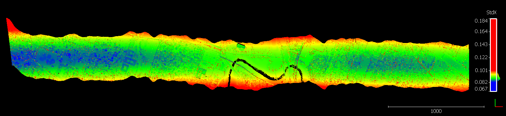
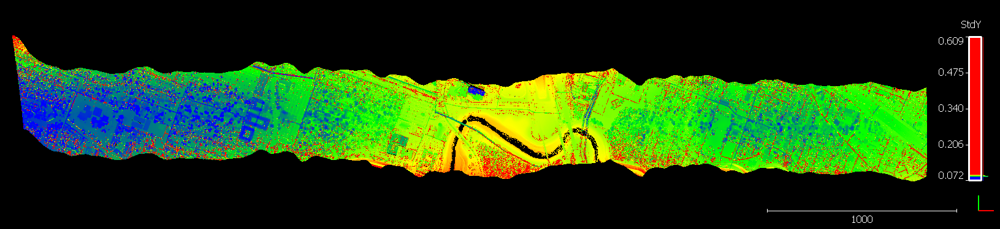
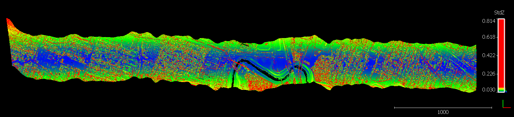

To finish, let's re-tile the flightline TPU point clouds and then crop the tiles to the desired boundary. We'll deliver both the complete and cropped tile sets to our colleague. Be prepared to wait - the tiling took about 70 minutes on my machine.

```bash
(pdal-als-tpu) pjhartze@GSE-10:/mnt/f/uh$ mkdir ./tpu/tiles
(pdal-als-tpu) pjhartze@GSE-10:/mnt/f/uh$ mkdir ./tpu/tiles-cropped
(pdal-als-tpu) pjhartze@GSE-10:/mnt/f/uh$ tree -d -L 3
.
├── flightlines
├── tiles
│   ├── las
│   ├── laz
│   │   └── ept
│   └── laz-normal
├── tpu
│   ├── flightlines
│   ├── sensor-profiles
│   ├── tiles
│   └── tiles-cropped
└── trajectories
(pdal-als-tpu) pjhartze@GSE-10:/mnt/f/uh$ pdal tile "./tpu/flightlines/*.laz" "./tpu/tiles/tpu-#.laz" --origin_x="271000" --origin_y="3288000" --length="1000" --writers.las.minor_version="4" --writers.las.extra_dims="NormalX=float,NormalY=float,NormalZ=float,StdX=float,StdY=float,StdZ=float,VarianceX=float,VarianceY=float,VarianceZ=float,CovarianceXY=float,CovarianceXZ=float,CovarianceYZ=float"
```

I wrote a small Python script to convert the tile labels from an `Xoffset_Yoffset` index pattern to an `Xcoordinate_Ycoordinate` coordinate pattern to match the original tile names.

```python
import os
import re

for filename in os.listdir("."):
    if filename.startswith("tpu"):
        x_pattern = "-(.*?)_"
        y_pattern = "_(.*?)\."
        x = re.search(x_pattern, filename).group(1)
        y = re.search(y_pattern, filename).group(1)

        x_new = 271000 + int(x) * 1000
        y_new = 3289000 + int(y) * 1000

        os.rename(filename, f"tpu-{x_new}_{y_new}.laz")
```

Finally, let's crop the TPU tiles to the requested boundary and built a new EPT index to view the cropped data in QGIS.

```bash
(pdal-als-tpu) pjhartze@GSE-10:/mnt/f/uh$ ls ./tpu/tiles/*.laz | parallel -j+0 pdal translate {} ./tpu/tiles-cropped/{/} crop '--filters.crop.polygon="POLYGON((-95.3626777088979 29.7299851318979, -95.3200545956866 29.7304501531127, -95.3194574429247 29.7135007355585, -95.3622914533177 29.7135025021551, -95.3626777088979 29.7299851318979))"' '--filters.crop.a_srs="epsg:4326"' '--writers.las.minor_version=4' '--writers.las.extra_dims="all"'
(pdal-als-tpu) pjhartze@GSE-10:/mnt/f/uh$ entwine build -i ./tpu/tiles-cropped -o ./tpu/tiles-cropped/ept
(pdal-als-tpu) pjhartze@GSE-10:/mnt/f/uh$ tree -d -L 3


```


### **8. Summary**

Kudos if you've made it this far. It looks like a lot of steps to generate TPU in this example, but much of the walk-through dealt with data cleaning and formatting and the complexity due to the triple channel ALS sensor:

1. Data cleaning: provide missing CRS information, data compression, identification and removal of spurious in-air points, and `ScanAngleRank` sign correction.
2. Data formatting: flightline extraction and re-tiling, renaming, and cropping for delivery.
3. Triple channel sensor: three strips of data for each flightline exist that require unique uncertainty parameters but a common trajectory.

But the above example is a real-world look at how to go from a collection of point data that has been dropped in your lap to a set of point cloud tiles cropped to your area of interest that contain per-point TPU information. If you are dealing with a single channel sensor and a clean set of data (perhaps even provided in flightlines rather than tiles), the TPU generation process will be much more streamlined. Refer to the [GitHub repository](https://github.com/pjhartzell/pdal-als-tpu) for the `als_tpu` PDAL plugin filter for a simple example.